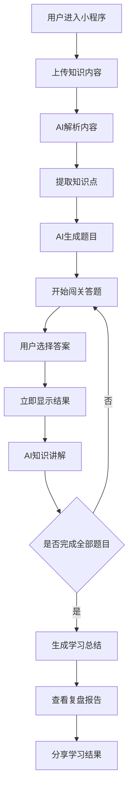

# AI 互动学习闯关小程序｜需求分析文档（MVP版）

## 一、项目概述

### 1.1 项目背景

当前中小学生的学习产品普遍存在以下问题：

- 学习过程枯燥
- 被动阅读效率低
- 缺少即时反馈
- 缺少趣味互动
- 学完之后难以复盘
- 家长无法快速了解学习情况

而 AI 大模型的出现，使“自动解析知识 → 自动生成题目 → 互动式学习”成为可能。

本项目的核心目标是：

> 将任何知识内容，自动转化为“可闯关、可互动、可复盘”的学习体验。

产品本质上是：

> “AI 自动出题 + 游戏化学习 + 知识复盘”的学习工具。

------

# 二、产品定位

## 2.1 产品一句话定位

> 用户上传任意学习内容，AI 自动生成互动闯关题目，帮助中小学生更有趣地学习知识。

------

## 2.2 核心用户

### 目标用户

中小学生（小学～初中为主）

------

## 2.3 核心使用者

### 学生

主要使用者：

- 自主学习
- 课后复习
- 背知识点
- 考前刷题
- 趣味学习

------

### 家长

辅助使用者：

- 帮孩子整理学习内容
- 查看学习结果
- 查看错题情况
- 监督学习进度

------

# 三、核心用户场景

## 场景1：课后复习

学生上传：

- 数学课 PPT
- 老师发的 PDF
- 一段课堂笔记

AI 自动生成：

- 选择题
- 判断题
- 闯关问答

学生边玩边复习。

------

## 场景2：考试前刷重点

学生输入：

> “帮我复习中国古代历史”

AI 自动：

- 提炼重点
- 生成知识闯关
- 输出易错题

------

## 场景3：英语单词学习

用户上传：

- 单词表
- 英语文章

AI 自动：

- 生成单词选择题
- 中英互译
- 语境填空

------

## 场景4：家长辅助学习

家长上传：

- 奥数资料
- 作文范文
- 视频课程链接

孩子直接进入答题模式。

------

# 四、产品核心价值

## 对学生的价值

### 1）降低学习枯燥感

相比阅读：

- “做题”
- “闯关”
- “即时反馈”

更容易持续学习。

------

### 2）提升记忆效率

AI 通过：

- 问答
- 反复强化
- 错题反馈

提高记忆效果。

------

### 3）降低整理学习资料成本

用户无需自己出题。

上传资料即可学习。

------

## 对家长的价值

### 1）降低辅导成本

家长无需：

- 手动整理题目
- 手动检查答案

AI 自动完成。

------

### 2）更容易看到学习结果

包括：

- 正确率
- 错题
- 学习时长
- 知识掌握情况

------

# 五、项目可行性分析

## 5.1 为什么这个项目值得做

当前 AI 学习产品大多数有两个问题：

### 问题1：AI 太“工具化”

很多 AI 学习产品：

- 更像聊天机器人
- 缺少游戏感
- 缺少持续学习动力

------

### 问题2：内容生产成本高

传统题库：

- 人工维护成本高
- 更新慢
- 泛化能力弱

AI 自动生成题目，可以极大降低内容成本。

------

## 5.2 本项目的核心优势

### 优势1：支持任意知识输入

不是固定题库。

用户可以：

- 上传文档
- 上传笔记
- 上传网页
- 上传视频链接

------

### 优势2：即时生成互动学习

传统学习：
“先看 → 再练”

本产品：
“边学 → 边问 → 边强化”

------

### 优势3：天然适合小游戏场景

微信小程序非常适合：

- 闯关
- 连续答题
- 排行
- 分享
- 轻量学习

------

# 六、竞品调研

## 6.1 国内竞品

### 作业帮

特点：

- 拍照搜题
- 题库丰富
- 学科覆盖广

问题：

- 更偏“解题”
- AI互动感较弱
- 缺少游戏化学习

------

### 猿辅导

特点：

- 大班课
- AI练习
- 题库系统成熟

问题：

- 内容偏固定
- 用户无法自由上传知识

------

### 小猿搜题

特点：

- 搜题效率高
- 用户量大

问题：

- 偏工具型
- 不具备“AI知识转闯关”能力

------

## 6.2 海外竞品

### Quizlet

特点：

- 卡片学习
- AI生成题目
- 学习模式丰富

优势：

- 学习闭环成熟

缺点：

- 中文场景较弱
- 不适合小程序生态

------

### Kahoot!

特点：

- 游戏化答题
- 多人互动强

问题：

- 更偏课堂互动
- 个性化内容生成较弱

------

### Duolingo

特点：

- 游戏化极强
- 连续学习机制成熟

可借鉴点：

- 闯关机制
- 奖励机制
- 学习反馈

------

# 七、MVP 最小可行版本（核心重点）

## 7.1 MVP 核心原则

### 只做：

> “上传知识 → AI出题 → 闯关答题 → 即时讲解 → 复盘”

其余复杂功能全部后置。

------

# 八、MVP 功能范围

## 8.1 用户输入知识

### 支持：

- 输入文本
- 上传文档
- 上传网页链接
- 上传视频链接

------

## 8.2 AI 自动解析内容

AI 自动：

- 提取知识点
- 总结重点
- 识别可出题内容

------

## 8.3 AI 自动生成题目

题型（MVP）：

- 单选题
- 判断题

暂不做复杂题型。

------

## 8.4 闯关答题

功能：

- 一题一页
- 实时反馈
- 显示正确答案
- AI讲解原因

------

## 8.5 学习总结

通关后生成：

- 学习总结
- 错题总结
- 正确率
- 知识薄弱点

------

## 8.6 学习记录

用户可查看：

- 学过什么
- 正确率
- 最近学习记录

------

# 九、MVP 明确不做的功能

为了保证项目能快速上线，以下功能暂时不做：

## 暂不做列表

- 多人PK
- 排行榜
- AI语音读题
- AI生图
- 社交系统
- 班级系统
- 家长端
- AI老师聊天
- 复杂知识图谱
- 长视频深度解析
- 企业知识库
- 会员体系
- 积分商城
- 复杂动画系统
- 多语言国际化

------

# 十、用户核心流程

## 10.1 主流程（Mermaid）

------

# 十一、核心功能结构

## 11.1 首页

功能：

- 上传资料
- 最近学习记录
- 开始学习

------

## 11.2 AI解析页

功能：

- 显示解析进度
- 展示提取知识点

------

## 11.3 闯关页

功能：

- 题目
- 选项
- 正误反馈
- AI讲解

------

## 11.4 学习报告页

功能：

- 正确率
- 错题
- 知识总结
- 学习时长

------

# 十二、功能核对清单（Task Checklist）

## 基础功能

-  用户登录
-  首页展示
-  上传文本
-  上传文档
-  上传网页链接
-  上传视频链接

------

## AI功能

-  AI解析学习内容
-  AI提取知识点
-  AI生成题目
-  AI生成答案
-  AI生成知识讲解
-  AI生成学习总结

------

## 学习功能

-  开始闯关
-  单题作答
-  实时显示结果
-  显示正确答案
-  错题解释
-  统计正确率

------

## 学习记录

-  保存学习历史
-  保存错题
-  查看学习报告

------

## 分享功能

-  生成分享卡片
-  分享到微信

------

# 十三、后续扩展规划（优先级）

# P1（上线后优先做）

## 1）错题强化训练

AI 自动：

- 重新出题
- 针对性强化

------

## 2）学习连续签到

提升留存。

------

## 3）题目难度控制

支持：

- 简单
- 普通
- 困难

------

## 4）更多题型

包括：

- 填空题
- 连线题
- 简答题

------

# P2（中期扩展）

## 1）AI生图题目

适用于：

- 英语单词
- 地理
- 生物

------

## 2）多人PK

适合：

- 同学互动
- 班级比赛

------

## 3）排行榜系统

增强竞争感。

------

## 4）语音读题

适合低龄儿童。

------

# P3（长期扩展）

## 1）企业知识库训练（RAG）

适用于：

- 企业培训
- 学校题库
- 教培机构

------

## 2）AI学习伙伴

AI陪练老师。

------

## 3）知识图谱

自动构建：

- 知识关联
- 学习路径

------

# 十四、风险分析

## 14.1 AI 幻觉风险

问题：

AI可能生成错误答案。

解决方向：

- 限制题目来源
- 引用原文知识
- 增加答案校验

------

## 14.2 内容质量风险

问题：

用户上传内容质量差。

导致：

- 题目质量低
- 解析不准确

------

## 14.3 未成年人产品风险

需要注意：

- 内容安全
- 隐私保护
- 防沉迷
- 不良内容过滤

------

## 14.4 成本风险

AI生成题目会产生：

- Token成本
- 文件解析成本

MVP阶段应：

- 控制题目数量
- 限制单次上传大小

------

# 十五、项目价值判断

## 15.1 是否值得做

结论：

> 值得做，而且非常适合 AI 独立开发者切入。

------

## 原因1：需求真实存在

学生天然需要：

- 刷题
- 复习
- 趣味学习

------

## 原因2：AI能力与场景高度匹配

AI非常适合：

- 总结知识
- 自动出题
- 即时讲解

------

## 原因3：产品具备传播性

学习结果：

- 可分享
- 可挑战
- 可PK

天然适合社交传播。

------

## 原因4：MVP 足够轻

前期：

只需要完成：

- 上传
- AI解析
- AI出题
- 答题
- 总结

即可上线验证。

------

# 十六、最终建议

## 推荐路线

### 第一阶段（最重要）

只做：

> “上传知识 → AI生成题目 → 闯关学习”

快速上线验证。

------

### 第二阶段

增加：

- 错题强化
- 连续学习
- 分享机制

提升留存。

------

### 第三阶段

增加：

- PK
- 排行榜
- AI陪练

增强增长能力。

------

# 十七、最终总结

这是一个：

> “AI 将任意知识自动转化为互动学习体验”的产品。

它的核心竞争力不在“题库”，而在：

- AI自动生成
- 游戏化学习
- 即时反馈
- 个性化知识输入

对于中小学生场景：

这是一个具备真实需求、低门槛切入、且适合快速MVP验证的方向。